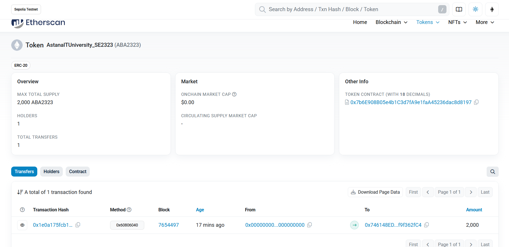

# Sample Hardhat Project

This project demonstrates a basic Hardhat use case. It comes with a sample contract, a test for that contract, and a Hardhat Ignition module that deploys that contract.

Try running some of the following tasks:

```shell
npx hardhat help
npx hardhat test
REPORT_GAS=true npx hardhat test
npx hardhat node
npx hardhat ignition deploy ./ignition/modules/Lock.js
```



# AITU_ABA_SE2323 Token Project

This project implements the **AITU_ABA_SE2323** ERC-20 token using Solidity and Hardhat. The project includes unit tests, deployment scripts, and a Hardhat configuration for deployment on the Sepolia test network.

## Features
- **ERC-20 Token Implementation**
- **Custom Token Name & Symbol**: `AstanaITUniversity_SE2323 (ABA2323)`
- **Initial Supply Allocation**
- **Transfer & Approval Mechanisms**
- **Transaction Logging & Timestamp Formatting**
- **Event Emission for Transfers**
- **Custom Error Handling**

## Project Structure
```
├── contracts/                 # Solidity smart contracts
│   ├── AITU_ABA_SE2323.sol    # Token contract
├── test/                      # Unit tests
│   ├── AITU_ABA_SE2323.js     # Mocha/Chai tests
├── scripts/                   # Deployment scripts
│   ├── deploy.js              # Deployment script
├── hardhat.config.js          # Hardhat configuration file
├── .env                       # Environment variables (ignored in Git)
├── .gitignore                 # Git ignore file
├── package.json               # Node.js dependencies
└── README.md                  # Project documentation
```

## Prerequisites
Ensure you have the following installed:
- [Node.js](https://nodejs.org/) (v16+ recommended)
- [Hardhat](https://hardhat.org/)
- [MetaMask](https://metamask.io/)
- An Infura API Key for Sepolia deployment
- Sepolia test ETH (for deployment & transactions)

## Installation
1. Clone the repository:
   ```sh
   git clone <repository-url>
   cd AITU_ABA_SE2323
   ```
2. Install dependencies:
   ```sh
   npm install
   ```
3. Set up your environment variables:
   - Create a `.env` file in the root directory:
     ```sh
     INFURA_API_KEY=<your-infura-api-key>
     SEPOLIA_PRIVATE_KEY=<your-private-key>
     ```

## Running Tests
To execute unit tests with Hardhat, run:
```sh
npx hardhat test
```

## Deploying the Smart Contract
1. Compile the contract:
   ```sh
   npx hardhat compile
   ```
2. Deploy to the Sepolia testnet:
   ```sh
   npx hardhat run scripts/deploy.js --network sepolia
   ```
3. The contract address will be displayed in the terminal after deployment.

## License
This project is licensed under the MIT License.

## Author
Astana IT University - Software Engineering SE2323


